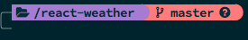
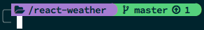
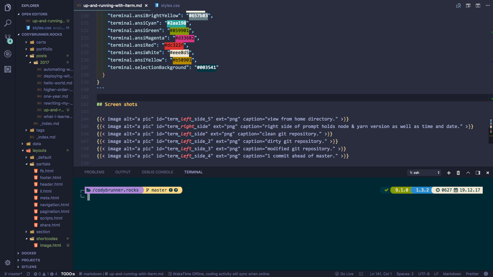

I have worked in the native Terminal on my Mac since I got started programming a year and a half ago. I had my customized setup for the bash environment and all my custom aliases and functions. To be honest it worked fine for me. Then one day I saw auto-completion for things I could not auto-complete in my shell and was like:

> _Must have this, must have this right now!_

So this is an article about setting up [iTerm2](https://www.iterm2.com/), getting started with [zsh](http://www.zsh.org/) and integrating this with my text editor of choice [VSCode](https://code.visualstudio.com/).

## iTerm2

For the longest time I had seen people making use of this, but was too zealous about my bash setup to want to make the switch to some other terminal.

### Installing

Now at the time of writing this iTerm2 is at version 3.1.5; why it is not _iTerm3_ I don't really know :confused:

```zsh
# If you don't have `homebrew` installed I would suggest it. Makes life so much easier!
# https://brew.sh/
brew update
brew cask install iterm2
brew cask cleanup
```

### Preferences

By traveling to `Preferences > Profiles` we can begin setting up how we want our terminal to look I downloaded and utilize the [Solarized Dark - Patched Theme](https://raw.githubusercontent.com/mbadolato/iTerm2-Color-Schemes/master/schemes/Solarized%20Dark%20-%20Patched.itermcolors) ([instructions](http://iterm2colorschemes.com/)) and a specific [Source Code Pro](https://github.com/powerline/fonts) that will work with the zsh theme later on.

## Zsh

I had heard of this but wasn't to sure what it was besides that it was like bash but apparently better. There are quite a few different ways to customize your shell when working with zsh as well and I went with using the highly talked about [oh-my-zsh](https://github.com/robbyrussell/oh-my-zsh). This bootstrapped thingy is chalked full of goodies. Hundreds of predefined aliases, plugins, sensible defaults. It's seriously pretty sweet!

### Installation

```zsh
# Mac comes with `zsh` present but lets get the latest version.
brew install zsh
# Get `oh-my-zsh`
sh -c "$(curl -fsSL https://raw.githubusercontent.com/robbyrussell/oh-my-zsh/master/tools/install.sh)"
# Change `zsh` to the default shell
chsh -s /usr/local/bin/zsh
```

You will now have a `~/.zshrc` file & `.oh-my-zsh/` directory in your home directory. The `~/.zshrc` will be full of lots of comments on what all is possible with this file thanks to the `oh-my-zsh` bootstrap.

### Themes

To use a theme we just add the theme to the line in our `~/.zshrc` below. I chose to use the [Powerlevel9k theme](https://github.com/bhilburn/powerlevel9k):

```zsh
# install `powerlevel9k`
git clone https://github.com/bhilburn/powerlevel9k.git ~/.oh-my-zsh/custom/themes/powerlevel9k
vi .zshrc
ZSH_THEME="powerlevel9k/powerlevel9k"
source .zshrc
```

## Powerlevel9k

This is like the cadillac of themes in zsh and has some pretty awesome features already enabled by default. You can tweak and customize nearly everything to what your needs are and I recommend reading through the docs and wiki to find out what all your options are!

I wanted to use the [Nerd Fonts](https://github.com/ryanoasis/nerd-fonts) library with powerlevel9k so I needed to add the following to my `~/.zshrc`:

```zsh
POWERLEVEL9K_MODE="nerdfont-complete"
```

### Plugins

One of the great things about zsh are the plugins you can utilize to make your life easier as a developer. Adding auto-complete and suggestions alone is a huge boost in productivity and less keystrokes :wink: The best part is that most of these plugins come pre-installed with `oh-my-zsh`. You can find them in `~/.oh-my-zsh/plugins/`. Here are just a few, in my honest opinion, must haves :smiley:

```sh
plugins=(
  zsh-autosuggestions
  zsh-completions
  zsh-syntax-highlighting
  )

# For `zsh-completions`
autoload -U compinit && compinit
```

> **NOTE** the more plugins you add can effect the performance of your shell.

## VSCode

I found that there were some real issues when using the above setup with vscode. For one the icons came in looking like crazy symbols and the color scheme was terrible. I read through the issues on powerlevel9k and found that I needed to change some settings in the `settings.json` for vscode to properly take in my setup:

```json
{
  "terminal.external.osxExec": "iTerm.app",
  "terminal.integrated.fontFamily": "MesloLGL Nerd Font",
  "terminal.integrated.fontSize": 14
}
```

I found that the font I was using with iTerm2 would not work correctly in vscode so I switched to _MesloLGL Nerd Font_. That fixed the icons issue but I still had problems with the color scheme just not being right at all. I use the [Material Theme](https://marketplace.visualstudio.com/items?itemName=Equinusocio.vsc-material-theme) as the theme in my editor so it has set the color scheme on all the portions of the editor. After looking at some of the documentation on customizing themes on the vscode website I found that I could tweak the colors of the terminal in the `settings.json`. You can read about it in the following [issue](https://github.com/bhilburn/powerlevel9k/issues/672). I just went with the same colors from the theme I was using in iTerm2, but if you have the time play around with it and make it look how you want it.

```json
{
  "workbench.colorCustomizations": {
    "terminal.background": "#002833",
    "terminal.foreground": "#839496",
    "terminal.ansiBlack": "#003541",
    "terminal.ansiBlue": "#268bd2",
    "terminal.ansiBrightBlack": "#586e75",
    "terminal.ansiBrightBlue": "#839496",
    "terminal.ansiBrightCyan": "#93a1a1",
    "terminal.ansiBrightGreen": "#586e75",
    "terminal.ansiBrightMagenta": "#6c6ec6",
    "terminal.ansiBrightRed": "#cb4b16",
    "terminal.ansiBrightWhite": "#fdf6e3",
    "terminal.ansiBrightYellow": "#657b83",
    "terminal.ansiCyan": "#2aa198",
    "terminal.ansiGreen": "#859901",
    "terminal.ansiMagenta": "#d33682",
    "terminal.ansiRed": "#dc322f",
    "terminal.ansiWhite": "#eee8d5",
    "terminal.ansiYellow": "#b58901",
    "terminal.selectionBackground": "#003541"
  }
}
```

## Screen shots







## Wrap Up

I am loving the new setup using iTerm2 + zsh. You should give it a try and see how much you enjoy working in your terminal :heart:. You can find my configuration in this [gist](https://gist.github.com/rockchalkwushock/eb0dcb5ecf2c8621d12db7ce0c15fcaa).

<!-- End of Post -->

> **Happy Coding!**

**~ Cody** :rocket:
