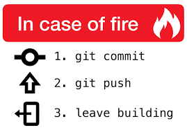
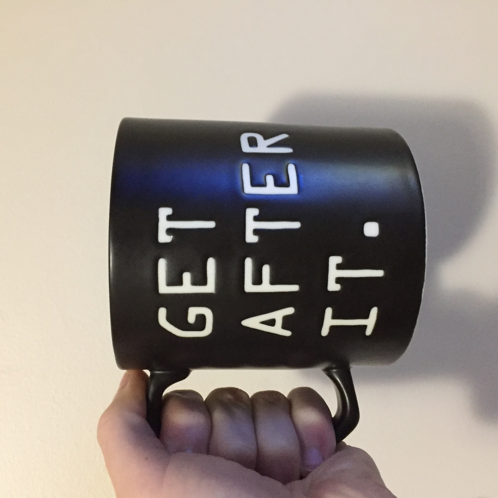

That's right folks!

> "Happy New Years...on February 5th"

Some of us are finally starting the year. My 2017 ended, well not so good and spilled over into 2018. There was a fire in my apartment building and I lost quite a bit. Mostly I lost time which I can't get back and insurance won't reimburse :cry: Let me tell you something though, when a firefighter yells out: _"Y'all need to get the @#$% out of here now!"_ the below meme does not hold true at all:

Lost all of the JavaScript blog series I had been working on and a mobile project I had just gotten started on. :sob:

I had told myself this about the next year:

> "2018 will be your year dammit. You are gonna own this year and finally get where you want to be."

I might be starting a month late, but watch your back because I'm here and now it's time for one and only one thing:

## What the :fire: really showed me

A lot more than a fire left me emotionally and mentally bankrupt at the end of 2017. I came to the stark realization a lot more was on fire in my life than my kitchen. Living out of a hotel for five weeks, thanks to insurance, left me with a lot of time to look in the mirror and confront my demons. To wake up to the fact of how alone I was and how I was using so many things to fill that void that were no bueno. To realize I was not treating some people in my life as good as I had thought, in fact I was horrible to them. I am still coming to terms with it all and I haven't handled everything I want and need to yet, but I will.

**To my family**: "Thank you for having my back through it all."

**To my friends**: "There are like 3 of you total I truly give this title to, you know who you are. Thank you for being here to talk to and encouraging me to keep going and even more so for calling me on my b.s. regularly."

**To my best friend**: "Words can't describe to you the sorrow in my heart over all that has happened between you and I. An apology is all I can ever offer because of the circumstances you know of, it just feels so cheap, dirty, and easy. I never meant nor wanted to hurt you or be someone you think little of. I think and pray for you everyday and always will. I hope you can find it in your heart to forgive me in the future and perhaps want to still be friends."

## Good things are coming!

Some great things have happened in the last week. I'm not sure if it was the below tweet, but [Kyle Holmberg](https://kylemh.com/) reached out to me and got me plugged-in with [Operation Code](https://operationcode.org/). This organization has been great and is helping me out a lot with the job search process. Really cannot say enough good things about them so far.

<blockquote class="twitter-tweet" data-align="center" data-conversation="none" data-lang="en">
Is there anyone, I mean anyone out there hiring for junior devs with <a href="https://twitter.com/hashtag/react?src=hash&amp;ref_src=twsrc%5Etfw">#react</a> &amp; <a href="https://twitter.com/hashtag/node?src=hash&amp;ref_src=twsrc%5Etfw">#node</a> experience? Desperate is an understatement on where I’m at. Please RT for visibility.  🙏🏻 <a href="https://twitter.com/hashtag/reactjs?src=hash&amp;ref_src=twsrc%5Etfw">#reactjs</a> <a href="https://twitter.com/hashtag/javascirpt?src=hash&amp;ref_src=twsrc%5Etfw">#javascirpt</a> <a href="https://twitter.com/hashtag/GraphQL?src=hash&amp;ref_src=twsrc%5Etfw">#GraphQL</a> <a href="https://twitter.com/hashtag/nodejs?src=hash&amp;ref_src=twsrc%5Etfw">#nodejs</a> <a href="https://twitter.com/hashtag/webdeveloper?src=hash&amp;ref_src=twsrc%5Etfw">#webdeveloper</a> <a href="https://twitter.com/hashtag/webdev?src=hash&amp;ref_src=twsrc%5Etfw">#webdev</a> <a href="https://twitter.com/hashtag/webdevelopment?src=hash&amp;ref_src=twsrc%5Etfw">#webdevelopment</a>
&mdash; Cody Brunner (@RockChalkDev) <a href="https://twitter.com/RockChalkDev/status/958018912880414721?ref_src=twsrc%5Etfw">January 29, 2018</a></blockquote>

## Pipeline

I spent a lot of that down time watching tutorials, taking notes, coming up with ideas, _writing code_ (no like litearlly pen and paper! :joy:) and I'm ready to get back to coding! That being said there is a pecking order for things:

1. The job hunt
2. Building with `elixir` & `phoenix`.
3. Starting that YouTube Channel...finally!

## Wrap Up

I hope you all have been having a stellar 2018 and have accomplished a lot already. I might be behind the curve a bit, but look out because here I come! :rocket: :sunglasses: :metal:

<!-- End of Post -->

> **Happy Coding!**

**~ Cody** :rocket:
