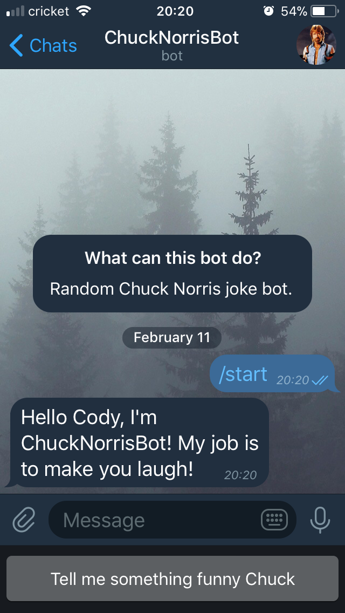
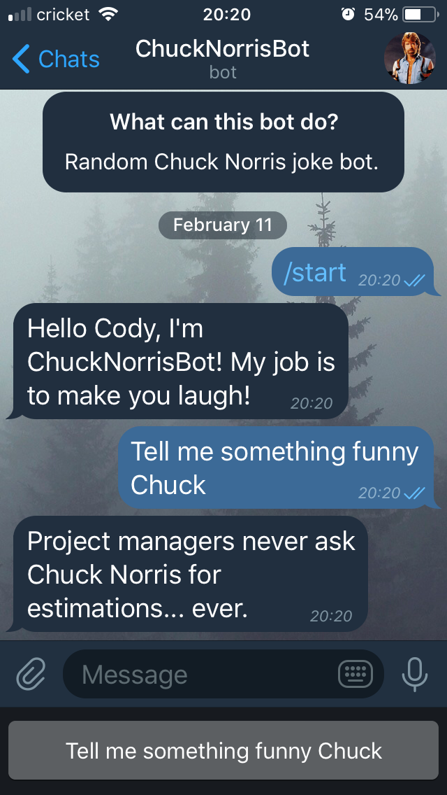
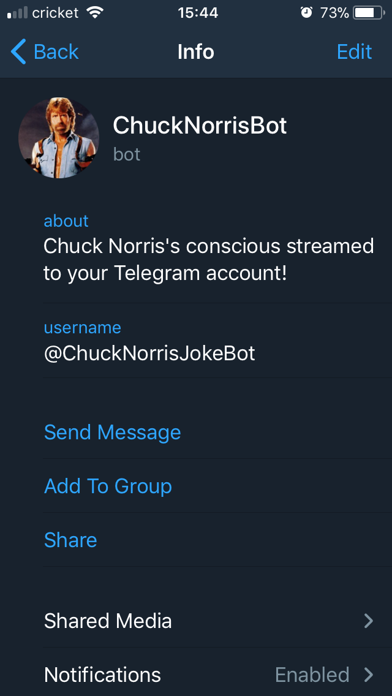

On a whim I decided I wanted to learn about how to make a bot on the popular messenger app [Telegram](https://telegram.org/). Really wasn't all that hard I just had no idea what I really wanted this thing to do. I was playing around with the API for a few hours and decided to make my mark on the platform with [@ChuckNorrisJokeBot](https://telegram.me/ChuckNorrisJokeBot). Yes I am a fan of these jokes they make me belly laugh :joy:

## Getting Started

Being that the only language I know that was available for use was JavaScript this is being built using NodeJS, specifically I opted to use the [micro-bot](https://github.com/telegraf/micro-bot) framework which is similar to the concept of [MicroJS](https://github.com/zeit/micro/) which I'm already quite familiar with and like a lot. Micro-bot is built upon the NodeJS library for the Telegram API called [Telegraf](http://telegraf.js.org/) which I felt was much easier to work with then the several other NodeJS libraries available.

```bash
yarn create bot telegram_chuck_norris_bot
cd telegram_chuck_norris_bot
```

You will need an account with Telegram. It's not very hard to setup just download the app on iOS/Android/MacOS/Windows/Linux and follow the instructions. Seriously though if you aren't using Telegram you should be for many many reasons...privacy and data security being just two.

## Creating a New Bot with Telegram

Telegram has _"one bot to rule them all"_ called [@BotFather](https://telegram.me/BotFather). Search for @BotFather and click start he will give you a help menu of all the options you have with him and you should then type in `/newbot`. You will be prompted for a name and a username for the bot (this must end in **bot**). Once you have created your bot you will be give a `BOT_TOKEN` that you will use to work with the Telegram Bot API. This needs to be kept secret and safe so choose to handle your environment variables however you like to do so. Micro-bot actually has a few flags one being `-t` for passing your token to the command and `-e` for any other environment variables you might have. You could do something such as:

```json
{
  "scripts": {
    "start": "micro-bot -t BOT_TOKEN -d DOMAIN -e MY_ENVVAR"
  }
}
```

Micro-bot requries that you pass it a **token** and a **domain** for the bot to run on and these are already recognized as `process.env.BOT_TOKEN` and `process.env.BOT_DOMAIN`. In this tutorial we are going to deploy from [CirclCi](https://circleci.com) to the [Now](https://circleci.com) platform.

## Writing the code for Chuck Norris to kick @$$

The [Chuck Norris API](http://www.icndb.com/api/) is super easy to use and requires no API key to use so it is about as _K.I.S.S_ (Keep It Simple Stupid) as it gets. We will just use the random joke endpoint for the bot and use the `isomorphic-fetch` package, which FYI is native to `node`, but not in a CI container...doh! Because this is 2018 we are not interested in callback hell or `then/catch` chains. No sir we are gonna use that shiny ESNext syntax `async/await`. We set this up to only return the joke because we want the bot to just tell a joke and have no need for other data here.

```bash
yarn add isomorphic-fetch
```

```javascript
// lib/Chuck.js
const fetch = require('isomorphic-fetch')

const { parseString } = require('./utils')

const fetchRandomJoke = async () => {
  try {
    const res = await fetch('https://api.icndb.com/jokes/random')
    const data = await res.json()
    if (data.type === 'success') {
      return parseString(data.value.joke)
    }
  } catch (e) {
    throw new Error(
      "Chuck Norris doesn't throw errors, he throws roundhouse kicks!"
    )
  }
}

module.exports = {
  fetchRandomJoke
}
```

Due to the JSON data quotes will come back as `&quot` so we need to replace this with actual quote symbols that is where `parseString` comes in. We will use the `.includes()` method to check that the joke string does or does not contain the _problemChild_ and if it doesn't just return the joke or run the `.replace()` method on the joke and look for our _problemChild_ and replace it with the desired output.

```javascript
// lib/utils.js
const problemChild = /&quot;/g

const parseString = str => {
  if (str.includes('&quot')) {
    return str.replace(problemChild, '"')
  }
  return str
}

module.exports = {
  parseString
}
```

## The Bot

Micro-bot exposes the Telegraf API to us in a few different manner and we will be using the `Composer` class. In the design of `micro` will will be exporting a single entry point or function as the surface of our Bot's API.

```javascript
// ./index.js
const { Composer } = require('micro-bot')

const app = new Composer()

module.exports = app
```

Telegram's Bot API is designed so that the only way bots can interact with user's is through user's interacting with the bots. No bot can message or interact with a user without a command being sent to it by the user.

```javascript
app.command('our_command', ctx => ourHandler(ctx))
```

Specifically Telegram's API states that users will see a _Start Button_ to begin interacting with your bot and that these [global commands](https://core.telegram.org/bots#global-commands) are avialable to you for use by default. We will send the user a start up message when they tap the start button that will tell the user who our bot is and what it does.

```javascript
// ./index.js
const { Composer, Markup } = require('micro-bot')

const app = new Composer()

app.command('start', ({ botInfo, replyWithMarkdown, update }) =>
  replyWithMarkdown(
    messages.start(botInfo, update),
    Markup.keyboard(['Tell me something funny Chuck'])
      .resize()
      .extra()
  )
)
```



## Listening for the user's response

Now we just need to implement a listener for the user's response of asking for a joke. This is where our function for making an API call to the Chuck Norris API will come into play. Sinc the function is an _asynchronous_ function we will make sure to use the `async/await` syntax here:

```javascript
app.hears('Tell me something funny Chuck', async ({ replyWithMarkdown }) => {
  const joke = await Chuck.fetchRandomJoke()
  replyWithMarkdown(joke)
})
```



## Adding information about your bot

Through @BotFather we can use commands to add information aobut our bot such as `/setdescription`, `/setabouttext`, `/setuserpic`, etc.



## Deploying the bot

I decided to write tests that can be found [here](https://github.com/rockchalkwushock/telegram_chuck_norris_bot/tree/master/__tests__) and use CircleCi to handle the deployment of the bot. Providing the `BOT_TOKEN` & `NOW_TOKEN` to CircleCi we can easily kickback and let it manage making sure our bot is ready for production before shipping. The full `config.yml` can be found [here](https://github.com/rockchalkwushock/telegram_chuck_norris_bot/blob/master/.circleci/config.yml).

```yaml
deploy_bot:
    docker:
      - image: 'circleci/node:latest'
    working_directory: ~/telegram_chuck_norris_bot
    steps:
      - attach_workspace:
          at: ~/telegram_chuck_norris_bot
      - run: yarn install
      - run: sudo yarn global add now
      - deploy:
          name: Deploy Bot.
          command: |
            if [ "${CIRCLE_BRANCH}" == "master" ]; then
              now -t ${NOW_TOKEN} -e BOT_TOKEN=${BOT_TOKEN} -n=telegram_chuck_norris_bot
              now -t ${NOW_TOKEN} alias telegram_chuck_norris_bot_v1
            elif [ "${CIRCLE_BRANCH}" == "development" ]; then
              now -t ${NOW_TOKEN} -e BOT_TOKEN=${BOT_TOKEN} -n=telegram_chuck_norris_bot
              now -t ${NOW_TOKEN} alias telegram_chuck_norris_bot_beta
            else
              echo "This failed miserably!"
            fi
```

## Wrap Up

Overall it's not very hard to get a bot deployed to Telegram there is far more you can do so I highly recommend you go checkout the docs on the Bots API and play around with it. I'm really interested in building a bot that will work with an Ethereum smart contract now or maybe waiting to see what Telegram does with their own coming crypto-currency Telegram Open Network (TON). Source code can be found [here](https://github.com/rockchalkwushock/telegram_chuck_norris_bot).

Give ol'Chucky a try if you are on Telegram [@ChuckNorrisJokeBot](https://telegram.me/ChuckNorrisJokeBot)! :metal:

<!-- End of Post -->

> **Happy Coding!**

**~ Cody** :rocket:
